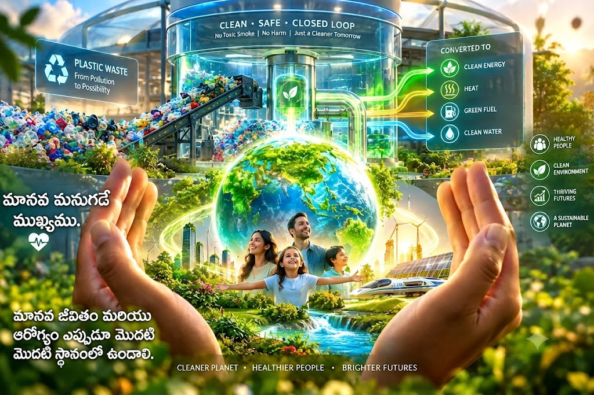

# Zero-Risk & Zero-Waste Power Ecosystem

An advanced theoretical and conceptual blueprint designed to convert municipal plastic waste into clean electrical energy while ensuring 100% human safety and zero toxic emissions.
## 🎨 Project Visual Architecture (Human + AI Synergy)

## Core Pillars of the Blueprint

1. **Waste-to-Energy Thermal Conversion:** Replacing fossil fuels (coal) by cleanly utilizing plastic and public waste in controlled boilers to generate high-pressure steam for electricity.
2. **Advanced Chemical Neutralization:** Moving beyond simple air filtration, utilizing alkaline scrubbers and catalytic reduction to chemically neutralize toxic acidic gases ($HCl$, $SO_2$, $NO_x$) into harmless elements.
3. **Byproduct Upcycling:** Transforming neutralized precipitates (like gypsum and inert slag) into valuable resources for sustainable construction and soil conditioning.
4. **Human Safety First:** Prioritizing public health and strict fire-safety protocols over short-term commercial profits, establishing a truly sustainable eco-system.

## Vision
"Human life and environmental survival take absolute precedence over financial shortcuts. True innovation means cleaning our planet while powering our future."
